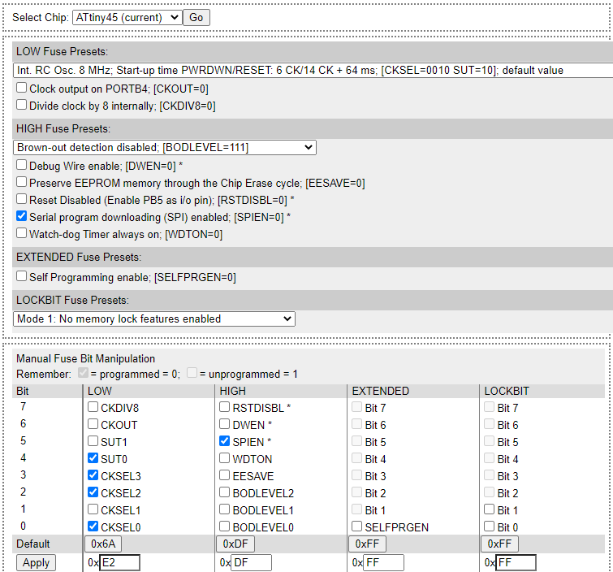

# FreqMul
PWM frequency multiplier for display backlight

                100n
         ┌───────┤├───────┐
         │ ┌────────────┐ │
         │ │ 1        8 ├─┴─ VCC
         │ │ 2        7 ├─ PB2 (INT0)  INPUT     
         │ │ 3        6 ├─ PB1 (OC1A)  OUTPUT
    GND ─┴─┤ 4        5 │
           └────────────┘
              ATtiny45
              
Compiler is avr-gcc / WinAVR

**Fuses**

lfuse: 0xE2  
hfuse: 0xDF  
efuse: 0xFF  

AVRDUDE	-U lfuse:w:0xE2:m	-U hfuse:w:0xDF:m	-U efuse:w:0xFF:m

[Link to fuses calculator](http://eleccelerator.com/fusecalc/fusecalc.php?chip=attiny45&LOW=E2&HIGH=DF&EXTENDED=FF&LOCKBIT=FF)
